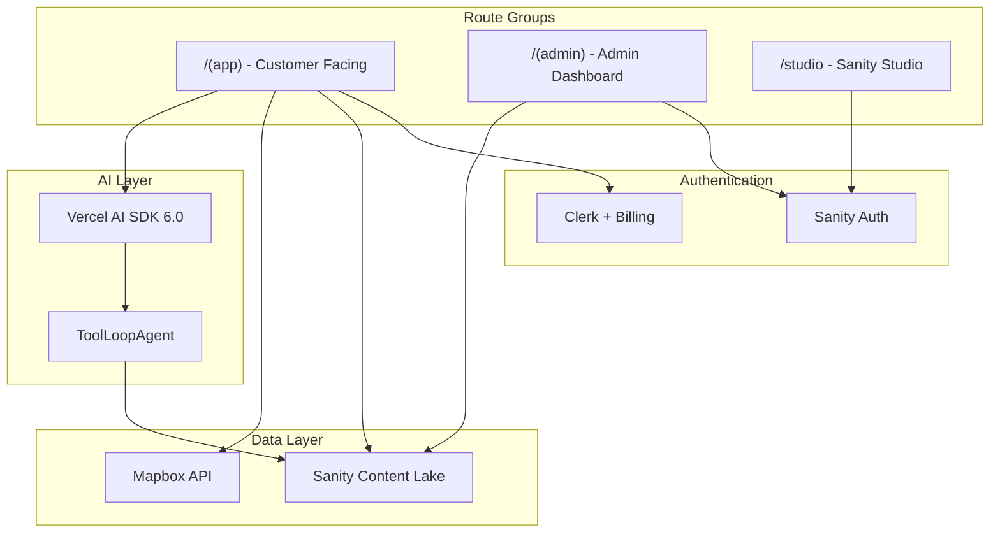
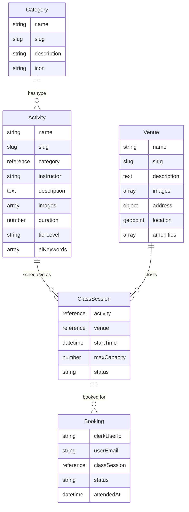
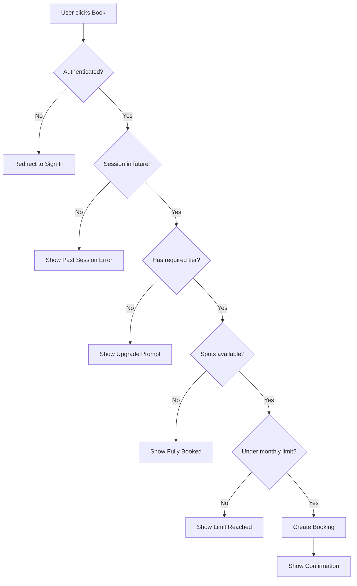

# ClassPass Clone Implementation Plan

## Architecture Overview



## Subscription Tiers

| Tier | Monthly Limit | Class Access | Monthly | Annual (save 17%) | Per Class |

|------|---------------|--------------|---------|-------------------|-----------|

| **Basic** | 5 classes | Basic-tier only | $29/mo | $290/yr ($24.17/mo) | ~$5.80 |

| **Performance** | 12 classes | Basic + Performance | $59/mo | $590/yr ($49.17/mo) | ~$4.92 |

| **Champion** | Unlimited | All classes | $99/mo | $990/yr ($82.50/mo) | Best value |

All tiers include a **3-day free trial**.

**Pricing Psychology:**

- Performance is the anchor tier (best value per class)
- Champion creates FOMO for users booking 8+ classes/month
- Show per-class pricing on upgrade prompts

---

## Phase 1: Foundation Setup

### 1.1 Install Core Dependencies

```bash
# Sanity
pnpm add sanity next-sanity @sanity/image-url @sanity/icons

# Authentication + Billing
pnpm add @clerk/nextjs

# State Management
pnpm add zustand

# UI Components
pnpm dlx shadcn@latest init

# Maps (Mapbox GL JS + React wrapper + Search/Geocoding)
pnpm add mapbox-gl react-map-gl @mapbox/search-js-react

# AI (6.0 beta)
pnpm add ai@beta @ai-sdk/openai

# Date handling
pnpm add date-fns
```

### 1.2 Environment Variables

```env
# Sanity
NEXT_PUBLIC_SANITY_PROJECT_ID=
NEXT_PUBLIC_SANITY_DATASET=production
NEXT_PUBLIC_SANITY_API_VERSION=2024-01-01
SANITY_API_TOKEN=

# Clerk
NEXT_PUBLIC_CLERK_PUBLISHABLE_KEY=
CLERK_SECRET_KEY=

# Mapbox
NEXT_PUBLIC_MAPBOX_ACCESS_TOKEN=

# AI
OPENAI_API_KEY=
```

### 1.3 Create Sanity Project

Run `pnpm create sanity@latest` or configure manually with existing project credentials.

---

## Phase 2: Sanity Schema Design (Priority)

All schemas go in [`sanity/schemaTypes/`](sanity/schemaTypes/).

### Schema Architecture



### 2.1 Venue Schema (`venueType.ts`)

Represents fitness studios/gyms where classes are held.

Fields:

- `name` (string, required)
- `slug` (slug, required)
- `description` (text)
- `images` (array of images)
- `address` (object with **Mapbox autocomplete custom input**):
  - `fullAddress` (string - display address)
  - `street` (string)
  - `city` (string)
  - `postcode` (string)
  - `country` (string)
- `location` (geopoint - auto-populated from address selection)
- `amenities` (array of strings: showers, lockers, parking, wifi, etc.)
- `openingHours` (array of objects: day, open, close)

**Custom Input Component:** `MapboxAddressInput` - Autocomplete that searches Mapbox Geocoding API, populates address fields and lat/lng automatically.

### 2.2 Category Schema (`categoryType.ts`)

Categories of fitness classes (Yoga, HIIT, Pilates, Cycling, etc.)

Fields:

- `name` (string, required)
- `slug` (slug, required)
- `description` (text)
- `icon` (string - icon identifier from @sanity/icons)

### 2.3 Activity Schema (`activityType.ts`)

**Reusable class template** - defines what a class is (not when it runs).

Fields:

- `name` (string, required) - e.g., "Morning Yoga Flow"
- `slug` (slug, required)
- `category` (reference to category, required)
- `instructor` (string, required)
- `description` (block content)
- `images` (array of images)
- `duration` (number - minutes, required)
- `tierLevel` (string with options: basic, performance, champion - required, radio layout)
- `aiKeywords` (array of strings - for AI search)
- `price` (number - display price)

### 2.4 Class Session Schema (`classSessionType.ts`)

**Scheduled instance** - when and where a class runs. Admin creates these manually.

Fields:

- `activity` (reference to activity, required) - which class template
- `venue` (reference to venue, required) - where it's held
- `startTime` (datetime, required) - must be in the future for new bookings
- `maxCapacity` (number, required)
- `status` (string: scheduled, cancelled, completed - default: scheduled)

**Preview:** Shows activity name + venue + formatted date/time

**Validation:**

- `startTime` must be in the future when creating

**Computed (via GROQ):**

- `currentBookings` - count of confirmed bookings
- `spotsRemaining` - maxCapacity - currentBookings
- `isFullyBooked` - spotsRemaining === 0

### 2.5 Booking Schema (`bookingType.ts`)

User class bookings stored in Sanity.

Fields:

- `clerkUserId` (string, required, readOnly)
- `userEmail` (string, required)
- `classSession` (reference to classSession, required)
- `status` (string: confirmed, cancelled, attended, noShow - default: confirmed)
- `createdAt` (datetime, auto-set)
- `cancelledAt` (datetime, set when cancelled)
- `attendedAt` (datetime, set when user confirms attendance)

**Attendance Logic:**

1. During session start time + 1 hour after session ends, user sees "I've Attended" button
2. User clicks button to confirm attendance
3. Sets `status: attended` and `attendedAt: now()`
4. After window expires, unconfirmed bookings auto-update to `status: noShow`

No check-in code required - simple honor system with time-based validation.

**No separate usage tracking schema** - Monthly usage calculated dynamically:

```groq
count(*[
  _type == "booking" 
  && clerkUserId == $userId 
  && status in ["confirmed", "attended"]
  && classSession->startTime >= $monthStart
  && classSession->startTime < $monthEnd
])
```

### 2.6 Register Schemas

Update [`sanity/schemaTypes/index.ts`](sanity/schemaTypes/index.ts) with all schema types:

- `venueType`
- `categoryType`
- `activityType`
- `classSessionType`
- `bookingType`

---

## Phase 3: Sanity Studio Configuration

### 3.1 Studio Setup

- Configure [`sanity.config.ts`](sanity.config.ts) at project root
- Create studio route at [`app/studio/[[...tool]]/page.tsx`](app/studio/[[...tool]]/page.tsx)
- Configure desk structure for organized content management

### 3.2 Studio Features

- Custom desk structure grouping: Activities, Sessions, Venues, Categories, Bookings
- Preview pane for sessions showing booking count and availability
- Actions for publishing/unpublishing

### 3.3 Mapbox Address Input Component

Custom input for venue addresses using **@mapbox/search-js-react** (official Mapbox Search SDK).

**Location:** `sanity/schemaTypes/venueType/MapboxAddressInput.tsx`

**Package:** `@mapbox/search-js-react` - provides `<AddressAutofill>` component with built-in autocomplete.

**Functionality:**

1. Uses Mapbox's `<AddressAutofill>` component for native autocomplete
2. Returns structured address data with coordinates
3. On selection:

   - Populates `fullAddress` string
   - Extracts and sets `street`, `city`, `postcode`, `country`
   - Sets `location` geopoint with `lat` and `lng`

**Implementation:**

```typescript
import { AddressAutofill } from "@mapbox/search-js-react";
import { TextInput, Stack, Text } from "@sanity/ui";
import { set, unset } from "sanity";
import type { ObjectInputProps } from "sanity";

const MapboxAddressInput = (props: ObjectInputProps) => {
  const { value, onChange } = props;
  
  const handleRetrieve = (res: any) => {
    const feature = res.features[0];
    const { properties, geometry } = feature;
    
    onChange(set({
      fullAddress: properties.full_address,
      street: properties.address_line1,
      city: properties.address_level2,
      postcode: properties.postcode,
      country: properties.country,
    }, ["address"]));
    
    onChange(set({
      _type: "geopoint",
      lat: geometry.coordinates[1],
      lng: geometry.coordinates[0],
    }, ["location"]));
  };
  
  return (
    <Stack space={3}>
      <AddressAutofill 
        accessToken={process.env.NEXT_PUBLIC_MAPBOX_ACCESS_TOKEN}
        onRetrieve={handleRetrieve}
      >
        <TextInput placeholder="Start typing an address..." />
      </AddressAutofill>
      {value?.address?.fullAddress && (
        <Text size={1} muted>{value.address.fullAddress}</Text>
      )}
    </Stack>
  );
};
```

This uses the official Mapbox SDK for reliable autocomplete with structured address data.

---

## Phase 4: Clerk Authentication + Billing

### 4.1 Clerk Setup

- Create [`proxy.ts`](proxy.ts) with `clerkMiddleware()`
- Wrap `app/(app)/layout.tsx` with `ClerkProvider`
- Create sign-in/sign-up pages

### 4.2 Clerk Billing Configuration

Configure 3 subscription plans in Clerk Dashboard:

- `plan_basic` - Basic tier (5 classes/month)
- `plan_performance` - Performance tier (12 classes/month)  
- `plan_champion` - Champion tier (unlimited)

All with 3-day free trial enabled.

### 4.3 Subscription Helpers

Create [`lib/subscription.ts`](lib/subscription.ts):

```typescript
// Tier hierarchy: champion > performance > basic
const TIER_HIERARCHY = { basic: 1, performance: 2, champion: 3 };

const TIER_LIMITS = {
  basic: 5,
  performance: 12,
  champion: Infinity, // Unlimited
};

const TIER_PRICING = {
  basic: { monthly: 29, annual: 290, perClass: 5.80 },
  performance: { monthly: 59, annual: 590, perClass: 4.92 },
  champion: { monthly: 99, annual: 990, perClass: null }, // Unlimited
};

// Get user's current tier from Clerk billing
export async function getUserTier(userId: string): Promise<Tier> {
  // Query Clerk for active subscription
}

// Check if user tier can access activity tier
export function canAccessClass(userTier: Tier, activityTier: Tier): boolean {
  return TIER_HIERARCHY[userTier] >= TIER_HIERARCHY[activityTier];
}

// Get monthly limit for tier
export function getMonthlyLimit(tier: Tier): number {
  return TIER_LIMITS[tier];
}

// Calculate remaining bookings dynamically from Sanity
export async function getRemainingBookings(userId: string): Promise<number> {
  const monthStart = startOfMonth(new Date());
  const monthEnd = endOfMonth(new Date());
  
  const usedCount = await sanityClient.fetch(`
    count(*[
      _type == "booking" 
      && clerkUserId == $userId 
      && status in ["confirmed", "attended"]
      && classSession->startTime >= $monthStart
      && classSession->startTime < $monthEnd
    ])
  `, { userId, monthStart, monthEnd });
  
  const tier = await getUserTier(userId);
  const limit = getMonthlyLimit(tier);
  
  return Math.max(0, limit - usedCount);
}
```

**No separate usage document** - All usage calculated dynamically from bookings.

---

## Phase 5: Class Browsing UI

### 5.1 Homepage (`app/(app)/page.tsx`)

- Hero section with search
- **Upcoming user bookings** (if logged in) - quick access to check-in
- **Usage meter** - "3 of 5 classes booked this month"
- Featured upcoming sessions grid
- Category filters (Yoga, HIIT, etc.)
- Location-based filtering

### 5.2 Sessions List (`app/(app)/classes/page.tsx`)

Browse upcoming scheduled class sessions.

- Grid of session cards showing:
  - Activity name + image
  - Venue name + location
  - Date/time
  - **Spots remaining** or "Fully Booked" badge
  - Tier badge (basic/performance/champion)
- Filter by: category, tier, date, venue
- Sort by: date (default), distance
- Only shows future sessions

### 5.3 Session Detail (`app/(app)/classes/[slug]/page.tsx`)

Single session page (combines activity + venue + time).

- Activity image gallery
- Activity description, instructor
- Duration, tier badge
- **Capacity display**: "8 of 12 spots remaining"
- Venue details with embedded Mapbox map
- Date/time prominently displayed
- **Book button** with states:
  - "Book Class" (available)
  - "Fully Booked" (capacity reached)
  - "Upgrade to Book" (tier locked)
  - "Class Passed" (session in past)

### 5.4 Activity Detail (`app/(app)/activities/[slug]/page.tsx`)

Browse a class template and see all its scheduled sessions.

- Activity info: name, description, instructor, duration, tier
- Image gallery
- **Upcoming sessions list** at various venues/times
- Each session shows availability

### 5.5 Venue Detail (`app/(app)/venues/[slug]/page.tsx`)

- Venue images and info
- Address with Mapbox map
- Amenities list
- **Upcoming sessions at this venue** - grouped by date

---

## Phase 6: Map Feature

### 6.1 Map Page (`app/(app)/map/page.tsx`)

- Full-screen Mapbox map
- Pins for all venues with upcoming classes
- Cluster markers for dense areas
- Click pin to see venue popup with classes
- "Near me" geolocation button
- Filter controls overlay

### 6.2 Map Components

- [`components/app/MapView.tsx`](components/app/MapView.tsx) - Main map component
- [`components/app/VenueMarker.tsx`](components/app/VenueMarker.tsx) - Custom pin with class count
- [`components/app/VenuePopup.tsx`](components/app/VenuePopup.tsx) - Popup with venue info and classes

---

## Phase 7: Booking System

### 7.1 Booking Flow



Validation checks (in order):

1. User must be authenticated
2. Session `startTime` must be in the future
3. User's tier must have access to activity's `tierLevel`
4. Session must have available spots (currentBookings < maxCapacity)
5. User must not exceed monthly booking limit for their tier

### 7.2 Booking API Routes

- `app/api/bookings/create/route.ts` - Create booking with all validations
- `app/api/bookings/cancel/route.ts` - Cancel booking (opens up a spot)
- `app/api/bookings/confirm-attendance/route.ts` - Mark attended (time-window validated)
- `app/api/bookings/usage/route.ts` - Get dynamic monthly usage count

### 7.3 Capacity Tracking

Spots are calculated dynamically, not stored:

```groq
// Get session with booking count
*[_type == "classSession" && _id == $sessionId][0]{
  ...,
  "currentBookings": count(*[
    _type == "booking" 
    && classSession._ref == ^._id 
    && status == "confirmed"
  ]),
  "spotsRemaining": maxCapacity - count(*[
    _type == "booking" 
    && classSession._ref == ^._id 
    && status == "confirmed"
  ])
}
```

When a booking is cancelled:

- Status changes to `cancelled`
- `cancelledAt` is set
- Spot automatically becomes available (dynamic count)

### 7.4 Attendance Confirmation

**Attendance Window:** Session start time until 1 hour after session ends.

```typescript
// Calculate attendance window
const sessionStart = new Date(session.startTime);
const sessionEnd = new Date(sessionStart.getTime() + session.activity.duration * 60000);
const windowEnd = new Date(sessionEnd.getTime() + 60 * 60000); // +1 hour

const canConfirmAttendance = now >= sessionStart && now <= windowEnd;
```

**Simple Confirmation Flow:**

1. User navigates to their bookings during valid window
2. Booking shows "I've Attended" button (only visible during window)
3. User clicks button → booking status changes to `attended`, `attendedAt` set
4. Success toast: "Attendance confirmed!"

**Auto No-Show:** Background job or webhook marks unconfirmed bookings as `noShow` after window expires.

### 7.5 Booking UI

- [`components/app/BookingButton.tsx`](components/app/BookingButton.tsx) - Smart button showing:
  - "Book" (available)
  - "Fully Booked" (no spots)
  - "Upgrade to Access" (tier locked)
  - "Limit Reached" (monthly cap hit)
- [`components/app/UpgradePrompt.tsx`](components/app/UpgradePrompt.tsx) - Modal for tier upgrade via Clerk Billing
- [`components/app/UsageMeter.tsx`](components/app/UsageMeter.tsx) - Visual: "3 of 5 classes used this month"
- [`components/app/AttendanceButton.tsx`](components/app/AttendanceButton.tsx) - "I've Attended" button (only shown during valid window)

### 7.6 Manage Bookings (`app/(app)/bookings/page.tsx`)

- **Upcoming bookings** - with cancel button (if before session start)
- **Ready for attendance** - bookings in attendance window with "I've Attended" button
- **Past bookings** - with attended/noShow status badge
- Filter by status

---

## Phase 8: AI Search Assistant

### 8.1 AI Agent Setup

Using Vercel AI SDK 6.0 beta with ToolLoopAgent pattern.

### 8.2 Agent Tools

Define tools in [`lib/ai/tools.ts`](lib/ai/tools.ts):

- `searchClasses` - Query Sanity for classes matching criteria
- `getClassDetails` - Fetch full class info
- `getVenueClasses` - Get classes at specific venue
- `checkAvailability` - Check if class has spots
- `getUserBookings` - Get user's upcoming classes

### 8.3 AI API Route (`app/api/ai/chat/route.ts`)

- Streaming chat endpoint
- Tool execution loop
- Context: user tier, location, preferences

### 8.4 Chat UI (`components/app/AIAssistant.tsx`)

- Floating chat button
- Slide-out panel or modal
- Message history with class cards embedded
- Quick actions from AI suggestions

---

## Phase 9: Admin Dashboard (Sanity App SDK)

> Only start after Sanity Studio is complete and tested.

### 9.1 Admin Layout (`app/(admin)/layout.tsx`)

- Wrap with `SanityApp` provider
- Sanity authentication
- Sidebar navigation

### 9.2 Dashboard Home (`app/(admin)/page.tsx`)

- Overview stats (total bookings, active users, popular classes)
- Recent bookings list
- Capacity alerts

### 9.3 Booking Management (`app/(admin)/bookings/page.tsx`)

- List all bookings with filters
- Update booking status
- View user booking history

### 9.4 Class Management (`app/(admin)/classes/page.tsx`)

- Manage classes with real-time updates
- View capacity and bookings per class
- Quick actions (cancel class, notify users)

---

## Phase 10: Polish and Deployment

### 10.1 Loading States

- Skeleton components for class grids
- Loading states for map
- Optimistic UI for bookings

### 10.2 Error Handling

- Error boundaries
- Toast notifications
- Graceful degradation

### 10.3 Deployment

- Configure Vercel environment variables
- Set up Clerk webhooks for subscription changes
- Test full booking flow in production

---

## File Structure

```
app/
  layout.tsx                    # Root layoges erut (minimal)
  
  (app)/                        # Customer routes (Clerk auth)
    layout.tsx                  # ClerkProvider, BookingStoreProvider
    page.tsx                    # Homepage
    classes/
      page.tsx                  # Sessions list (upcoming classes)
      [slug]/page.tsx           # Session detail (activity + venue + time)
    activities/
      page.tsx                  # Browse all activities
      [slug]/page.tsx           # Activity detail (class template)
    venues/
      [slug]/page.tsx           # Venue detail
    map/page.tsx                # Map view
    bookings/page.tsx           # Manage bookings + attendance
    sign-in/[[...sign-in]]/page.tsx
    sign-up/[[...sign-up]]/page.tsx
  
  (admin)/                      # Admin dashboard (Sanity auth)
    layout.tsx                  # SanityApp provider
    page.tsx                    # Dashboard home
    bookings/page.tsx
    sessions/page.tsx
  
  api/
    bookings/
      create/route.ts
      cancel/route.ts
      confirm-attendance/route.ts
      usage/route.ts
    ai/chat/route.ts
  
  studio/[[...tool]]/page.tsx   # Sanity Studio

components/
  app/
    SessionCard.tsx             # Class session card with availability
    SessionGrid.tsx
    ActivityCard.tsx            # Activity/class template card
    BookingButton.tsx           # Smart button with all states
    UpgradePrompt.tsx
    UsageMeter.tsx
    AttendanceButton.tsx        # "I've Attended" button
    MapView.tsx
    VenueMarker.tsx
    AIAssistant.tsx
    Header.tsx
  admin/
    BookingList.tsx
    SessionList.tsx
    Dashboard.tsx

lib/
  store/
    booking-store.ts
    booking-store-provider.tsx
  subscription.ts
  ai/
    tools.ts
    agent.ts

sanity/
  schemaTypes/
    venueType/
      index.ts                  # Schema with custom input
      MapboxAddressInput.tsx    # Mapbox Geocoding autocomplete
    categoryType.ts
    activityType.ts
    classSessionType.ts
    bookingType.ts
    index.ts
  lib/
    client.ts
    queries.ts
    image.ts
```

---

## Recommended Build Order

| Phase | Description | Deliverable |

|-------|-------------|-------------|

| 1 | Foundation | Dependencies installed, env configured |

| 2 | Sanity Schemas | All schemas created and registered |

| 3 | Sanity Studio | Studio accessible at /studio |

| 4 | Clerk + Billing | Auth working, subscription tiers configured |

| 5 | Class Browsing | Homepage, class list, class detail pages |

| 6 | Map Feature | Mapbox integration with venue pins |

| 7 | Booking System | Full booking/cancel flow with limits |

| 8 | AI Assistant | ToolLoopAgent with Sanity tools |

| 9 | Admin Dashboard | Real-time admin with Sanity App SDK |

| 10 | Polish | Loading states, errors, deployment |

---

## Key Decisions Summary

| Decision | Choice |

|----------|--------|

| Package Manager | pnpm |

| CMS | Sanity |

| Customer Auth | Clerk |

| Billing/Subscriptions | Clerk Billing |

| Maps | Mapbox GL |

| AI | Vercel AI SDK 6.0 beta (ToolLoopAgent) |

| Admin Auth | Sanity (via App SDK) |

| State Management | Zustand |

| UI Components | Shadcn/ui + Tailwind CSS v4 |