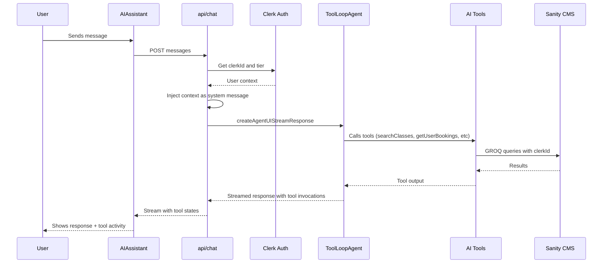

# Finish AI Assistant Implementation

## Current State Analysis

The AI assistant has the foundational structure in place but needs fixes to work correctly with [AI SDK 6 Beta](https://v6.ai-sdk.dev/docs/announcing-ai-sdk-6-beta):

**Critical Issue:**

- **Tool definition syntax** - Using `parameters` instead of `inputSchema` (this is a breaking change in v6)

**Enhancements:**

- **Missing bookings tool** - Users can't ask about their own bookings
- **Missing user context** - Agent doesn't know user's clerkId to query their bookings
- **UI incomplete** - Doesn't display tool invocations or results to users

---

## Implementation Plan

### 1. Fix Tool Definitions for AI SDK 6 (CRITICAL)

Update all 6 tools in [`lib/ai/tools.ts`](lib/ai/tools.ts) to use `inputSchema` instead of `parameters`:

```typescript
// Before (BROKEN in v6)
export const searchClasses = tool({
  description: "...",
  parameters: z.object({ ... }),  // Wrong!
  execute: async ({ ... }) => { ... }
});

// After (correct for v6)
export const searchClasses = tool({
  description: "...",
  inputSchema: z.object({ ... }),  // Correct!
  execute: async ({ ... }) => { ... }
});
```

This applies to all 6 tools: `searchClasses`, `getClassSessions`, `searchVenues`, `getCategories`, `getSubscriptionInfo`, `getRecommendations`.

### 2. Add User Bookings Tool

Add a new `getUserBookings` tool to [`lib/ai/tools.ts`](lib/ai/tools.ts) that allows users to ask about their bookings:

```typescript
// Get user's bookings (upcoming or past)
export const getUserBookings = tool({
  description:
    "Get the current user's bookings. Can filter by upcoming or past bookings. Use this when users ask about their scheduled classes, booking history, or want to know what classes they have coming up.",
  inputSchema: z.object({
    type: z
      .enum(["upcoming", "past", "all"])
      .optional()
      .describe("Filter bookings: 'upcoming' for future classes, 'past' for completed, 'all' for everything"),
  }),
  execute: async ({ type = "upcoming" }, { clerkId }) => {
    // Query based on type - uses clerkId from context
    // Returns: class name, date/time, venue, status
  },
});
```

This tool will use the existing `USER_UPCOMING_BOOKINGS_QUERY` and `USER_BOOKINGS_QUERY` from [`sanity/lib/queries/bookings.ts`](sanity/lib/queries/bookings.ts).

### 3. Inject User Context via API Route

The API route needs to:

1. Get the user's `clerkId` from Clerk auth
2. Inject it into the agent context so the `getUserBookings` tool can query their bookings
3. Add tier info to personalize recommendations

Update [`app/api/chat/route.ts`](app/api/chat/route.ts):

```typescript
import { createAgentUIStreamResponse } from "ai";
import { fitnessAgent } from "@/lib/ai/agent";
import { auth } from "@clerk/nextjs/server";
import { getUserTier } from "@/lib/subscription";

export async function POST(request: Request) {
  const { messages } = await request.json();
  const { userId: clerkId } = await auth();
  const tier = await getUserTier();
  
  // Inject user context as a system message
  const enhancedMessages = [
    {
      role: "system",
      content: `Current user context:
- Clerk ID: ${clerkId ?? "Not authenticated"}
- Subscription tier: ${tier ?? "No subscription"}
When the user asks about their bookings, use the getUserBookings tool with their clerkId.`
    },
    ...messages
  ];

  return createAgentUIStreamResponse({
    agent: fitnessAgent,
    messages: enhancedMessages,
  });
}
```

The `getUserBookings` tool will extract the `clerkId` from the system message context.

### 4. Enhance Chat UI with Tool Display and Auth Guard

Update [`components/app/AIAssistant.tsx`](components/app/AIAssistant.tsx) to:

1. **Auth guard** - Only render the assistant for logged-in users using Clerk's `useUser` hook
2. **Display tool invocations** - Show when the agent is searching, what tools it's using
3. **Better loading states** - Show "Searching classes..." instead of just dots
```tsx
import { useUser } from "@clerk/nextjs";

export function AIAssistant() {
  const { isSignedIn, isLoaded } = useUser();
  
  // Don't render until Clerk is loaded, and only for authenticated users
  if (!isLoaded || !isSignedIn) {
    return null;
  }
  
  // ... rest of component
}
```


Also add auth check in [`app/api/chat/route.ts`](app/api/chat/route.ts):

```typescript
export async function POST(request: Request) {
  const { userId: clerkId } = await auth();
  
  // Reject unauthenticated requests
  if (!clerkId) {
    return new Response("Unauthorized", { status: 401 });
  }
  
  // ... rest of handler
}
```

Tool invocation display example (from [AI SDK 6 docs](https://v6.ai-sdk.dev/docs/announcing-ai-sdk-6-beta)):

```tsx
// Handle tool invocation states
if (invocation.state === 'output-available') {
  return (
    <div className="text-xs text-muted-foreground">
      Found {invocation.output.count} results
    </div>
  );
}
```

---

## Files to Modify

| File | Changes |

|------|---------|

| [`lib/ai/tools.ts`](lib/ai/tools.ts) | Change `parameters` to `inputSchema` for all 6 tools, add `getUserBookings` tool |

| [`app/api/chat/route.ts`](app/api/chat/route.ts) | Get clerkId from Clerk auth, inject user context |

| [`components/app/AIAssistant.tsx`](components/app/AIAssistant.tsx) | Add tool invocation display |

| [`sanity/lib/queries/ai.ts`](sanity/lib/queries/ai.ts) | Add AI_USER_BOOKINGS_QUERY for the bookings tool |

---

## Architecture Flow



---

## Verified Against Documentation

From [AI SDK 6 Beta docs](https://v6.ai-sdk.dev/docs/announcing-ai-sdk-6-beta):

- Tool definitions use `inputSchema` (not `parameters`)
- `createAgentUIStreamResponse({ agent, messages })` for streaming
- `useChat` from `@ai-sdk/react` for client-side
- `InferAgentUIMessage<typeof agent>` for type safety
- Tool invocations available via `message.toolInvocations` with states: `pending`, `output-available`, etc.