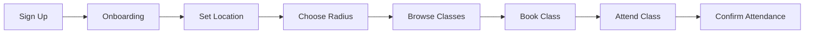
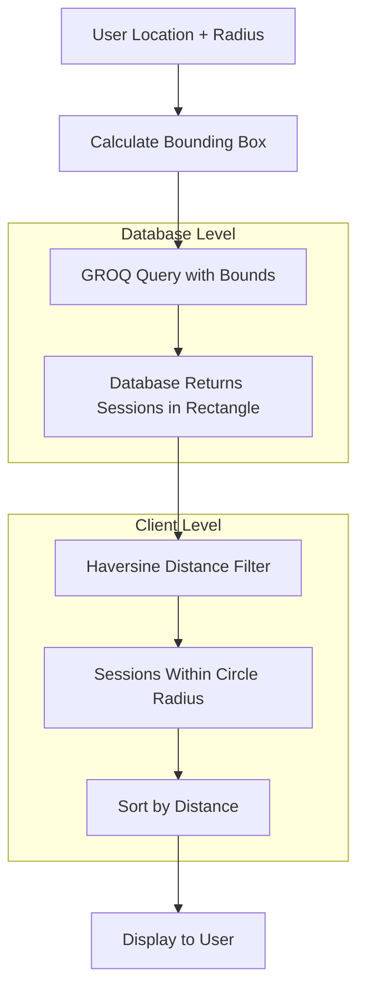
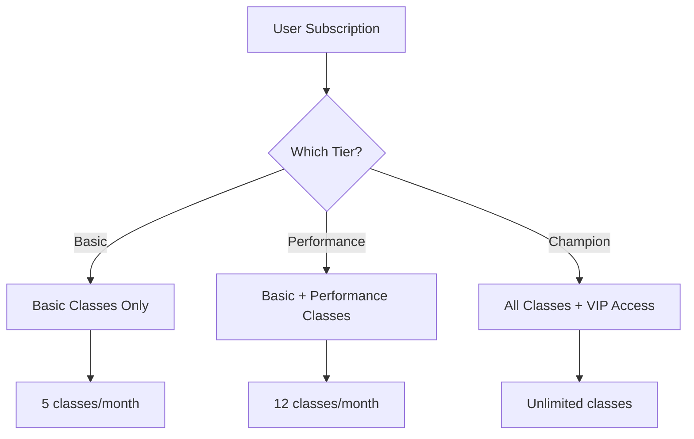

# FitPass - Fitness Class Booking Platform

[](LICENSE.md)
[](https://nextjs.org/)
[](https://www.sanity.io/)
[](https://clerk.com/)
[](https://vercel.com/ai)
[](https://www.mapbox.com/)

## One Membership. Thousands of Classes. Unlimited Possibilities.

> **Stop paying for multiple gym memberships.** FitPass gives you access to yoga studios, HIIT classes, cycling centers, and more — all with a single subscription. Discover classes near you, book instantly, and show up ready to sweat.

---

> ⚠️ **DEMO APPLICATION** - This is an educational demo project built for learning purposes. It demonstrates how to build a production-quality fitness booking platform using modern web technologies. The app showcases real-world patterns for authentication, subscription billing, real-time CMS, AI integration, and geographic filtering — all concepts you can apply to your own projects.

---

<table>
<tr>
<td width="33%">

### 🎯 Who Is This For?

Fitness enthusiasts who want **variety without the commitment** of multiple gym memberships. Perfect for:
- Gym-hoppers who get bored easily
- Travelers who want to work out anywhere
- Anyone exploring new fitness routines

</td>
<td width="33%">

### ⚡ What Makes It Different?

- **AI-Powered Discovery** - Get personalized class recommendations
- **Tier-Based Access** - Choose your level: Basic, Performance, or Champion
- **Location-First** - Find classes within your preferred travel radius
- **3-Day Free Trial** - Try before you commit

</td>
<td width="33%">

### 🛠️ Technical Highlights

- Real-time data with Sanity SDK React
- Clerk Billing with subscription tiers
- Geographic filtering (bounding box + Haversine)
- AI SDK 6.0 Beta ToolLoopAgent
- Leaflet maps + Mapbox autocomplete

</td>
</tr>
</table>

---

## 👇🏼 DO THIS Before You Get Started

Before diving into the code, you'll need accounts with these services.

> 💛 **A Quick Note About These Links:** The links below are affiliate/referral links. When you sign up through them, I may receive a small commission at no extra cost to you. **This is how I'm able to keep creating free educational content like this!** Every sign-up helps me dedicate more time to building projects, tutorials, and resources for the community. Thank you for your support! 🙏

| Service | What It's For | Sign Up Link |
|---------|---------------|--------------|
| **Clerk** | Authentication & Billing | [👉 Sign up for Clerk](https://go.clerk.com/84o4rVF) |
| **Sanity** | Content Management (CMS) | [👉 Sign up for Sanity](https://www.sanity.io/sonny?utm_source=youtube&utm_medium=video&utm_content=class-booking-platform) |
| **Mapbox** | Address Autocomplete | [Sign up for Mapbox](https://account.mapbox.com/) |
| **Vercel** | Hosting & AI Gateway | [Sign up for Vercel](https://vercel.com/) |

> 📦 **Want the source code?** [Get it here](https://www.papareact.com/class-booking-platform-build-form)

**Why use these links?**
- ✅ Same pricing as going direct (no extra cost to you)
- ✅ Supports free educational content creation
- ✅ Helps me build more projects like this
- ✅ Keeps tutorials free for everyone

---

## 🤔 What Is This App?

Think of FitPass as your **personal fitness passport**. Instead of being locked into one gym or studio, you get access to a network of fitness venues — all with a single membership.

### How It Works (The Simple Version)

1. **Sign up** and choose a subscription tier
2. **Set your location** and how far you're willing to travel
3. **Browse classes** happening near you (yoga, HIIT, cycling, boxing, etc.)
4. **Book a spot** and show up ready to work out
5. **Confirm attendance** to track your fitness journey

### Subscription Tiers

| Tier | Monthly Price | Classes/Month | Access Level |
|------|---------------|---------------|--------------|
| **Basic** | $29 | 5 classes | Basic-tier classes only |
| **Performance** | $59 | 12 classes | Basic + Performance classes |
| **Champion** | $99 | Unlimited | All classes (VIP access) |

All plans include a **3-day free trial** — no commitment, cancel anytime.

---

## 🚀 Before We Dive In - Join the PAPAFAM!

**Want to build apps like this from scratch?** Join thousands of developers who've leveled up their skills with PAPAFAM!

### What You'll Master

- ✅ Next.js 16 with App Router & Server Components
- ✅ Clerk authentication with subscription billing
- ✅ Sanity CMS with real-time SDK React
- ✅ AI integrations using Vercel AI Gateway
- ✅ Geographic filtering with Haversine formula
- ✅ Modern UI with shadcn/ui + Tailwind CSS
- ✅ Production deployment on Vercel

### The PAPAFAM Community

- 💬 Private Discord community
- 🎥 Step-by-step video tutorials
- 📁 Full source code access
- 🤝 Code reviews & mentorship
- 🏆 Real portfolio projects

### Real Results

> "I went from zero to landing my first dev job in 6 months following Sonny's tutorials!" - PAPAFAM Graduate

👉 **[Join the PAPAFAM Course](https://www.papareact.com/course)**

---

## ✨ Features

### For Fitness Enthusiasts

| Feature | Description |
|---------|-------------|
| 📍 **Location-Based Discovery** | Find classes within your preferred travel radius |
| 💳 **Flexible Subscriptions** | 3 tiers with a 3-day free trial on all plans |
| 🤖 **AI Fitness Assistant** | Get personalized class recommendations via chat |
| 🗺️ **Interactive Maps** | See venues on a map with real-time availability |
| 📅 **Easy Booking** | Book classes instantly, manage from your dashboard |
| ✅ **Attendance Tracking** | Confirm attendance when you arrive at class |

### Technical Features (The Smart Stuff)

| Feature | Technology |
|---------|------------|
| **Framework** | Next.js 16 with React 19 + App Router |
| **Database** | Sanity v4 with SDK React for real-time updates |
| **Auth & Billing** | Clerk with PricingTable component |
| **AI Assistant** | Vercel AI Gateway + AI SDK 6.0 Beta ToolLoopAgent |
| **Geographic Filtering** | Bounding box pre-filter + Haversine distance calculation |
| **Maps** | Leaflet for display + Mapbox for address autocomplete |
| **State Management** | Zustand for client-side state |
| **Styling** | Tailwind CSS v4 + shadcn/ui components |
| **Validation** | Zod for type-safe schemas |

---

## 🔄 How It Works

### User Booking Flow



### Geographic Filtering Pipeline



> **Why two-step filtering?** The bounding box query at the database level reduces 100k+ global sessions down to ~100-500 in the user's area. The Haversine formula then accurately filters for the circular radius. This is much faster than calculating distances for every session.

### Subscription Tier Access



---

## 🏁 Getting Started

### Prerequisites

Before you begin, make sure you have:

- Account with 💛 [Clerk](https://go.clerk.com/84o4rVF) 💛 (Authentication & Billing)
- Account with 💛 [Sanity](https://www.sanity.io/sonny?utm_source=youtube&utm_medium=video&utm_content=class-booking-platform) 💛 (Content Management)

> 💛 = Affiliate link — using these helps me create more free educational content like this!

### Step-by-Step Setup

1. **Clone the repository**

```bash
git clone <your-repo-url>
cd classpass-app-dec-nextjs-16-sanity-clerk-billing
```

2. **Install dependencies**

```bash
pnpm install
```

3. **Copy the environment file**

```bash
cp .env.example .env.local
```

4. **Configure environment variables** (see table below)

5. **Set up Clerk Billing**

   In your Clerk Dashboard:
   - Go to **Configure** > **Billing**
   - Create 3 products: Basic ($29/mo), Performance ($59/mo), Champion ($99/mo)
   - Enable 3-day free trial on each plan

6. **Import sample data to Sanity**

```bash
npx sanity dataset import sample-data.ndjson production
```

7. **Generate TypeScript types**

```bash
pnpm typegen
```

8. **Start the development server**

```bash
pnpm dev
```

9. **Open the app**

   - Frontend: [http://localhost:3000](http://localhost:3000)
   - Sanity Studio: [http://localhost:3000/studio](http://localhost:3000/studio)
   - Admin Backend: [http://localhost:3000/admin](http://localhost:3000/admin)

### Environment Variables

Create a `.env.local` file with these variables:

| Variable | Description | Where to Get |
|----------|-------------|--------------|
| `NEXT_PUBLIC_CLERK_PUBLISHABLE_KEY` | Clerk public key for client-side auth | [Clerk Dashboard](https://go.clerk.com/84o4rVF) 💛 > API Keys |
| `CLERK_SECRET_KEY` | Clerk secret key for server-side auth | [Clerk Dashboard](https://go.clerk.com/84o4rVF) 💛 > API Keys |
| `NEXT_PUBLIC_SANITY_PROJECT_ID` | Your Sanity project ID | [Sanity Manage](https://www.sanity.io/sonny?utm_source=youtube&utm_medium=video&utm_content=class-booking-platform) 💛 |
| `NEXT_PUBLIC_SANITY_DATASET` | Dataset name (e.g., "production") | [Sanity Manage](https://www.sanity.io/sonny?utm_source=youtube&utm_medium=video&utm_content=class-booking-platform) 💛 |
| `NEXT_PUBLIC_SANITY_API_VERSION` | API version (e.g., "2024-01-01") | Use current date |
| `SANITY_API_TOKEN` | Write token for mutations | Sanity > API > Tokens > Add Token (Editor) |
| `NEXT_PUBLIC_MAPBOX_ACCESS_TOKEN` | Mapbox public access token | [Mapbox Account](https://account.mapbox.com/) > Tokens |
| `AI_GATEWAY_API_KEY` | Vercel AI Gateway key | [Vercel Dashboard](https://vercel.com/) > AI |

> 💛 = Affiliate link — signing up through these links supports free content creation!

> ⚠️ **Security Note:** Never commit `.env.local` to git. Variables starting with `NEXT_PUBLIC_` are exposed to the browser — only use them for truly public keys.

---

## 📊 Database Schema Overview

FitPass uses Sanity CMS with the following document types:

```
┌─────────────────┐     ┌─────────────────┐
│   userProfile   │     │    category     │
│─────────────────│     │─────────────────│
│ clerkId         │     │ name            │
│ firstName       │     │ description     │
│ lastName        │     │ icon            │
│ email           │     └─────────────────┘
│ location        │              │
│ searchRadius    │              ▼
└─────────────────┘     ┌─────────────────┐
        │               │    activity     │
        │               │─────────────────│
        ▼               │ name            │
┌─────────────────┐     │ slug            │
│    booking      │     │ category ──────►│
│─────────────────│     │ instructor      │
│ user ──────────►│     │ description     │
│ classSession ──►│     │ duration        │
│ status          │     │ tierLevel       │
│ createdAt       │     │ images          │
│ attendedAt      │     └─────────────────┘
└─────────────────┘              │
        ▲                        ▼
        │               ┌─────────────────┐
        │               │  classSession   │
        └───────────────│─────────────────│
                        │ activity ──────►│
                        │ venue ─────────►│
                        │ startTime       │
                        │ maxCapacity     │
                        │ status          │
                        └─────────────────┘
                                 │
                                 ▼
                        ┌─────────────────┐
                        │     venue       │
                        │─────────────────│
                        │ name            │
                        │ address (geo)   │
                        │ description     │
                        │ amenities       │
                        │ images          │
                        └─────────────────┘
```

### Key Relationships

- **Activity** → Category (what type of class)
- **ClassSession** → Activity + Venue (when and where)
- **Booking** → User + ClassSession (who booked what)

---

## 🚀 Deployment

### Deploy to Vercel

1. **Push to GitHub**

```bash
git add .
git commit -m "Initial commit"
git push origin main
```

2. **Import to Vercel**

   - Go to [vercel.com/new](https://vercel.com/new)
   - Import your GitHub repository
   - Add all environment variables from `.env.local`
   - Deploy!

3. **Configure Clerk**

   In Clerk Dashboard, add your production URLs:
   - Add `https://your-app.vercel.app` to allowed origins
   - Update redirect URLs for sign-in/sign-up

4. **Configure Sanity CORS**

```bash
npx sanity cors add https://your-app.vercel.app --credentials
```

### Post-Deployment Checklist

- [ ] Test user sign-up and sign-in
- [ ] Verify subscription checkout works
- [ ] Confirm classes load with correct filtering
- [ ] Test booking flow end-to-end
- [ ] Check AI assistant responds correctly
- [ ] Verify maps display venues properly

---

## 🔧 Common Issues & Solutions

### Clerk Issues

**Problem:** "Clerk: Invalid API key"

**Solution:** Double-check your `NEXT_PUBLIC_CLERK_PUBLISHABLE_KEY` and `CLERK_SECRET_KEY` in `.env.local`. Make sure you're using the correct environment (development vs production).

---

**Problem:** PricingTable not showing plans

**Solution:** 
1. Go to Clerk Dashboard > Configure > Billing
2. Ensure you've created products with the correct metadata
3. Check that billing is enabled for your application

---

### Sanity Issues

**Problem:** "Error: CORS not allowed"

**Solution:** 
```bash
npx sanity cors add http://localhost:3000 --credentials
```

---

**Problem:** "Unauthorized" when writing documents

**Solution:** Generate a new API token with "Editor" permissions:
1. Go to Sanity Manage > API > Tokens
2. Create new token with "Editor" role
3. Update `SANITY_API_TOKEN` in `.env.local`

---

### Vercel AI Gateway Issues

**Problem:** AI assistant not responding

**Solution:** 
1. Verify `AI_GATEWAY_API_KEY` is set correctly
2. Check Vercel Dashboard > AI to ensure the gateway is configured
3. Verify you have credits/usage available

---

### Mapbox Issues

**Problem:** Address autocomplete not working

**Solution:** 
1. Verify `NEXT_PUBLIC_MAPBOX_ACCESS_TOKEN` is set
2. Check that your Mapbox token has the correct scopes
3. Ensure your domain is whitelisted in Mapbox settings

---

### Geographic Filtering Issues

**Problem:** No classes showing even though they exist

**Solution:** 
1. Check user's onboarding data (location + radius)
2. Verify venues have valid lat/lng coordinates
3. Increase search radius in profile settings

---

## 🏆 Take It Further - Challenge Time!

Ready to level up? Here are some advanced features you can add:

### User Experience

- [ ] **Email Notifications** - Send booking confirmations and reminders
- [ ] **Waitlist System** - Join waitlist when classes are full
- [ ] **Favorites** - Save favorite classes and venues
- [ ] **Social Sharing** - Share classes with friends

### Content Enhancements

- [ ] **Instructor Profiles** - Detailed pages for each instructor
- [ ] **Reviews & Ratings** - Let users rate classes they've attended
- [ ] **Class Photos** - User-uploaded photos from classes
- [ ] **Video Previews** - Embedded workout previews

### Technical Improvements

- [ ] **Push Notifications** - Real-time booking updates
- [ ] **Offline Support** - PWA for offline class viewing
- [ ] **Analytics Dashboard** - Track user engagement metrics
- [ ] **A/B Testing** - Optimize conversion with experiments

### Monetization

- [ ] **Referral Program** - Reward users for inviting friends
- [ ] **Corporate Plans** - Bulk subscriptions for companies
- [ ] **Pay-Per-Class** - Drop-in option without subscription
- [ ] **Gift Cards** - Purchasable gift memberships

---

## 📜 License

> 📚 **Educational Demo:** This is a demo application built for educational and learning purposes. It's designed to teach modern web development patterns and best practices.

This project is licensed under the **Creative Commons Attribution-NonCommercial 4.0 International License (CC BY-NC 4.0)**.

### You CAN:

- ✅ Use this code for **personal projects**
- ✅ Use this code for **learning and education**
- ✅ Modify and adapt the code
- ✅ Share with attribution

### You CANNOT:

- ❌ Use this code for **commercial purposes** without permission
- ❌ Sell this code or derivatives
- ❌ Remove attribution/credits

For commercial licensing inquiries, contact via [PAPAREACT](https://www.papareact.com/).

See [LICENSE.md](LICENSE.md) for the full license text.

---

## 📚 Quick Reference

### Useful Commands

| Command | Description |
|---------|-------------|
| `pnpm dev` | Start development server |
| `pnpm build` | Build for production |
| `pnpm start` | Start production server |
| `pnpm lint` | Run Biome linter |
| `pnpm format` | Format code with Biome |
| `pnpm typegen` | Generate Sanity TypeScript types |

### Key Files & Folders

| Path | Purpose |
|------|---------|
| `app/(app)/` | Main application routes |
| `app/(admin)/` | Admin dashboard routes |
| `app/studio/` | Sanity Studio embed |
| `components/` | Reusable UI components |
| `lib/ai/` | AI agent and tools configuration |
| `lib/actions/` | Server actions (bookings, profile) |
| `lib/constants/` | Subscription tiers and config |
| `sanity/schemaTypes/` | Sanity document schemas |
| `sanity/lib/queries/` | GROQ queries |

### Important Concepts

| Concept | Explanation |
|---------|-------------|
| **Activity** | A class template (e.g., "Morning Yoga Flow") |
| **ClassSession** | A scheduled instance of an activity |
| **Tier Level** | Access level required (basic/performance/champion) |
| **Bounding Box** | Rectangular area for database pre-filtering |
| **Haversine** | Formula for accurate distance calculation on Earth |

---

## 🙏 Acknowledgments

Built with love by [Sonny Sangha](https://www.youtube.com/@SonnySangha) and the PAPAFAM community.

- [Next.js](https://nextjs.org/) - The React framework
- [Sanity](https://www.sanity.io/sonny?utm_source=youtube&utm_medium=video&utm_content=class-booking-platform) - Structured content platform 💛
- [Clerk](https://go.clerk.com/84o4rVF) - Authentication and billing 💛
- [Vercel](https://vercel.com/) - Deployment and AI gateway
- [Mapbox](https://www.mapbox.com/) - Maps and geocoding
- [shadcn/ui](https://ui.shadcn.com/) - Beautiful UI components

---

## 💛 Support This Project

**Enjoyed this project?** Here's how you can help:

1. ⭐ **Star this repo** - It helps others discover it
2. 📺 **Subscribe** to [Sonny Sangha on YouTube](https://www.youtube.com/@SonnySangha)
3. 🔗 **Use the affiliate links** when signing up for services (no extra cost to you!)
4. 📣 **Share** this project with fellow developers
5. 🎓 **Join [PAPAFAM](https://www.papareact.com/course)** for more in-depth learning

Every little bit helps me continue creating free educational content for the developer community. Thank you! 🙏

---

**Happy coding! 🚀**
